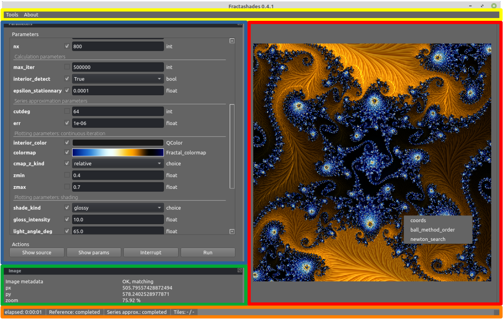

Getting started
***************

Installing
~~~~~~~~~~

Fractalshades is published on the Python Package Index (PyPI_). To install the
last published version and its dependencies, you should run: [#f1]_

.. code-block:: console

    pip install pip setuptools --upgrade
    pip install fractalshades

(The first line ensures your installation tools stay up-to-date)

To install directly the latest version from Github master:

.. code-block:: console

    pip install git+https://github.com/GBillotey/Fractalshades.git

This package relies on the following dependencies:

- numpy_
- numba_
- mpmath_
- gmpy2_
- Pillow_
- PyQt6_
- pygments_

.. _numpy: https://numpy.org/
.. _numba: http://numba.pydata.org/
.. _mpmath: https://mpmath.org/
.. _gmpy2: https://gmpy2.readthedocs.io/en/latest/
.. _Pillow: https://pillow.readthedocs.io/en/stable/
.. _PyQt6: https://pypi.org/project/PyQt6/
.. _PyPI: https://pypi.org/
.. _pygments: https://pygments.org/

They should install automatically through `pip`. A special case is gmpy2 as it
needs the most recent versions of GMP, MPFR and MPC multi-precision
arithmetic libraries. Under Windows, the recent wheels of gmpy2 (rev >= 2.1.2)
already ship the latest GMP / MPFR / MPC dll.
Under Unix / Linux, if your distribution does not include them you will have
to install them manually :

.. code-block:: console

    sudo apt-get install libgmp-dev
    sudo apt-get install libmpfr-dev
    sudo apt-get install libmpfi-dev
    sudo apt-get install libmpc-dev

.. [#f1] These instructions describe installation to your Python
         directory. You could also consider the installation of
         `Fractalshades` in a virtual environment (a self-contained directory
         tree that contains a Python installation for a particular version of
         Python), through venv_.

.. _venv: https://docs.python.org/3/tutorial/venv.html

A 5-minutes guide to fractalshades
~~~~~~~~~~~~~~~~~~~~~~~~~~~~~~~~~~

The best way to start is probably to have a look at the 
:doc:`examples/index/` section. Download one of the examples from the GUI
examples section, run it in an empty directory : good exploration !

:doc:`/examples/interactive_deepzoom/D01_run_interactive`

:doc:`/examples/interactive_deepzoom/D02_run_BS_interactive`.

.. code-block:: console

    python3 run_interactive.py

For advanced used you can also rely on batch mode, Fractalshades exposes 3
kinds of component each implementing a different functionality:

  - The core or calculation components runs under the hood all the
    calculations necessary for a plot and
    stores the intermediate raw results. This is typically done in a subclass
    of `fractalshades.Fractal` base class.
    The list of the available fractal models is found here :
    :doc:`API/models`.

  - The plotting components will open the raw results and apply user-selected
    post-processing, to generate the image output. The base class for this
    part is `fractalshades.Fractal_plotter`.
    Common post-processing routines are available, they are listed under
    the :doc:`API/postproc` section.

  - In order to explore a fractal and select a location, a graphical
    user interface is necessary.
    Fractalshades comes with a small yey  flexible and user-configurable
    GUI based on PyQt5 framework.

Graphical user interface
~~~~~~~~~~~~~~~~~~~~~~~~

As explained above, the GUI is launched by running a python scipt from an
interpretor. You should get something similar to :

The following main components can be seen:

  - in yellow, the main **toolbar**. The `tools` section provides:
       
       - A png tag reader, which can open an image created by fractalshades
         and output the list of parameters used for the computation (each
         image file produced by the programm is tagged with useful information
         like the location of the image, the program version,  the calculation
         parameters used) 
       - A png to colormap converter : load an image, draw a line on it : the
         colors will be used to create a colormap
       - A tool to select a colormap from the templates available (see 
         :doc:`/examples/colormaps/plot_cmaps` )
         with combo-box and a preview of the colormap selected.

  - in blue, the **parameters** window. The used parameters and their types
    are
    parsed from the python script, and a tailored editor is proposed based on
    the type (see `fractalshades.gui.Fractal_GUI` for details). The editor
    might be a simple text box, or for more complex objects
    a full pop-up or a dockable window.
    
      - Among these, 4 parameters which define the zoom will respond to
        the mouse events on the fractal image panel (`x`, `y`, `xy_ratio`,
        and the arbitrary precision in digits `dps`).
      - To view the scipt source code, click on "Show source".
      - To view the current value of the parameters, click on "Show params"
      - To actually run the script, click on "run".
      - On-going calculation can be also interrupted, this will become
        effective just after the current tile calculation is completed
        (allowing to display an intermediate result).

  - in red, the **fractal image** panel. It displays the last computed image
    (it is empty if no calculation has been run).
    It provides 3 kinds of user-interaction:

      - wheeling zooms / unzooms the static image
      - with a right-click you define a new zoom area that can be used for
        next calculation. (Double right clicking reset the zoom)
      - with a left-click, you can run some of the methods of the
        `fractalshades.Fractal` object (these are its methods tagged with a
        special decorator: `@fractalshades.utils.interactive_options`),
        the coordinates of the click will be passed.
        Current implementation of the deep zoom mandelbrot gives access to
        the coordinates, the cycle order, and a Newton search for nucleus.

  - in green, the **info** panel. It gives the current mouse position and
    zoom level (from the image panel).

  - in orange, the **status bar**. It provides information on the calculation
    progress (full precision orbit, series approximation, current tile, ...)

Finding areas of interest
~~~~~~~~~~~~~~~~~~~~~~~~~

For the normal precision fractals, it is usually sufficient to navigate
manually inside the fractal through the GUI:

  - left click, draw the new zoom rectangle, left click again to validate ;
    the coordinates in the parameters panel are updated automatically
  - press "run". A new calculation will be run taking into account the updated
    parameters

For arbitrary precision exploration however, zooming repetively inside a
deep minibrot can be tedious. For deep zooms in the Burning ship, it is even
not always obvious to find a miniship. This is where the Newton search for the
center of hyperbolic components comes handy :

  - right click on the image close the the estimated location of the target
    minibrot, select "Newton search"

  - Some parameters are needed to estimate the period of the influencing
    minibrot : 

        - maximum iteration (this should be more than the period, you can pick
          100000 as a starting point as calculation is fast)
        - radius in pixel (this is the size of a small ball - or ellipse in the
          case of the Burning ship) that will be iterated until it contains the
          critical point : this is the computed period. Usually, just keep the
          proposed value of 3 pixels.

  - a result table should pop-up. If all went well (the period has been
    estimated, a Newton calculation has been run and converged successfully)
    you should be provided the following new information:

        - **calculation dps** the precision used for the successful Newton
          search. Copy paste it in the parameter panel to use it for the next
          zoom
        - **x_nucleus**, **y_nucleus** the coordinates of the hyperbolic
          component center. Copy-paste also as the requested new center for the
          next image
        - **nucleus_size**, **julia_size** these are the estimation of the size
          of the hyperbolic component, and of its area of influence (embedded
          Julia). Usually the next zoom should be close to the embedded Julia
          parameter, copy-paste it as the new `dx`

  - for the non-holomorphic fractals (Burning-ship) you will get also 4
    coordinate of the local skew transformation (**skew_00**, **skew_01**,
    **skew_10**, **skew_11**). Copy-paste in the parameter panel and set
    `has_skew` to `True`. (Each time the skew is modified the calculation need
    to be re-run to validate the choice, otherwise the screen coordinates will
    not match the view anymore). Not that this option is usuful also at low
    zoom level, some areas of the Burning ship are very skewed at a standard
    zoom level

  - press "run"

For those interested in the implementation details we shall recommend the paper
quoted in `fractalshades.models.Perturbation_burning_ship`.

